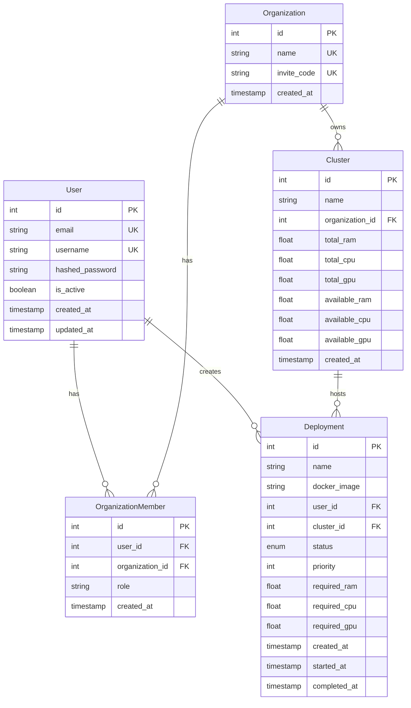

# Backend Cluster Service

A FastAPI-based backend service for managing user authentication, organization membership, cluster resource allocation, and deployment scheduling. The service optimizes for deployment priority, resource utilization, and maximizing successful deployments.

## Database Schema (UML)


## Prerequisites

- Python 3.7+
- PostgreSQL
- Redis
- Virtual Environment

## Installation

1. Clone the repository
```bash
git clone <repository-url>
cd backend-service
```

2. Create and activate virtual environment
```bash
python -m venv venv
source venv/bin/activate  # On Windows: venv\Scripts\activate
```

3. Install dependencies
```bash
pip install -r requirements.txt
```

4. Set up PostgreSQL
```bash
# Create database and user
createdb backendservice
createuser -s backenduser
psql backendservice
# In psql:
\password backenduser  # Set password
```

5. Set up Redis
```bash
# Install Redis (if not installed)
# On Mac:
brew install redis
# Start Redis
brew services start redis
```

6. Create .env file
```env
DB_USER=backenduser
DB_PASSWORD=your_password
DB_HOST=localhost
DB_PORT=5432
DB_NAME=backendservice
REDIS_HOST=localhost
REDIS_PORT=6379
REDIS_DB=0
SECRET_KEY=your_secret_key
```

## Database Initialization

1. Initialize database schemas and tables
```bash
python -m backend_service.database.base
```

2. Verify tables
```bash
psql -U backenduser -d backendservice
# In psql:
\dt auth.*
\dt organization.*
\dt cluster.*
```

## Running the Service

1. Start the FastAPI server
```bash
uvicorn backend_service.main:app --reload
```

2. Access the API documentation
- Swagger UI: `http://localhost:8000/docs`
- ReDoc: `http://localhost:8000/redoc`

## Running Tests

1. Install test dependencies
```bash
pip install pytest pytest-cov pytest-mock
```

2. Run all tests
```bash
pytest tests/
```

3. Run specific test files
```bash
# Resource management tests
pytest tests/test_resources.py

# Deployment tests
pytest tests/test_deployments.py

# Queue tests
pytest tests/test_queue.py

# Scheduler tests
pytest tests/test_scheduler.py
```

4. Run tests with coverage
```bash
pytest tests/ --cov=backend_service
```

## Project Structure
```
backend_service/
├── __init__.py
├── main.py
├── database/
│   ├── __init__.py
│   └── base.py
├── models/
│   ├── __init__.py
│   ├── auth.py
│   ├── organisation.py
│   └── cluster.py
├── scheduler/
│   ├── __init__.py
│   └── scheduler.py
└── tests/
    ├── __init__.py
    ├── conftest.py
    ├── test_resources.py
    ├── test_deployments.py
    ├── test_queue.py
    └── test_scheduler.py
```

## API Endpoints

### Authentication
- `POST /token` - Get authentication token
- `POST /users/` - Create new user

### Organizations
- `POST /organizations/` - Create organization
- `POST /organizations/{invite_code}/join` - Join organization

### Clusters
- `POST /clusters/` - Create cluster
- `GET /clusters/{cluster_id}/resources` - Get cluster resources

### Deployments
- `POST /deployments/` - Create deployment
- `GET /deployments/queue/metrics` - Get queue metrics
- `POST /deployments/{deployment_id}/start` - Start deployment
- `POST /deployments/{deployment_id}/complete` - Complete deployment

## Error Handling
The service includes comprehensive error handling:
- Database connection errors
- Redis connection errors
- Resource allocation failures
- Authentication/Authorization errors
- Invalid requests

## Contributing
1. Create feature branch
2. Make changes
3. Add tests
4. Create pull request

## License
[Your License]
